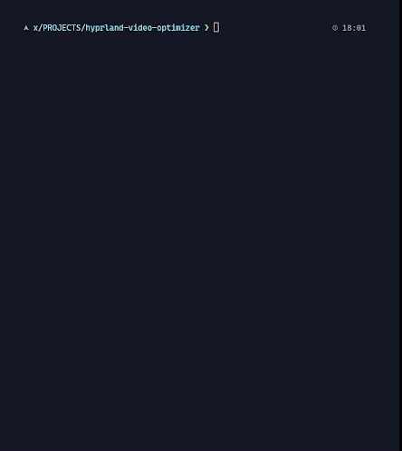

# 🎬 Hyprland Video Optimizer

Interactive H.265/HEVC video optimizer for Hyprland wallpapers. Reduce file sizes dramatically while keeping visual quality for animated wallpapers.

---

## ✨ Features

### Smart & Interactive
- Guided wizard with step-by-step prompts
- Auto-detect monitor resolution via `hyprctl monitors`
- Smart scaling: downscales large videos, never upscales (optional)
- Skip re-encoding for already optimized HEVC videos

### Hardware Acceleration
- NVIDIA GPU support (`hevc_nvenc`) — 10x+ faster encoding
- AMD GPU support (`hevc_amf` / `hevc_vaapi`)
- CPU fallback (`libx265`) — works everywhere
- Automatic GPU detection

### User-Friendly
- Simple quality presets — no need to understand CRF values
- Common resolution presets (4K, 1440p, 1080p) or custom
- FPS options (24, 30, 60) with descriptions
- Real-time progress tracking with batch counters

### Optimized Output
- H.265/HEVC encoding for maximum compression
- Audio removal (wallpapers don’t need sound)
- MP4 or MKV output formats
- Fast start flag for smooth playback

---

## 📋 Requirements

**Mandatory:**
- Arch Linux (or Arch-based distro)
- Hyprland (for auto-resolution detection)
- `ffmpeg` with HEVC support
- `jq` for JSON parsing
- `bc` for calculations

**Optional (for GPU acceleration):**
- NVIDIA GPU with NVENC support
- AMD GPU with AMF/VAAPI support

---

## 🚀 Quick Start

**Installation:**
The `install.sh` script will check and install dependencies (if you approve) and place the script in `~/.local/bin`.

    git clone https://github.com/XclusivVv/hyprland-video-optimizer.git
    cd hyprland-video-optimizer
    chmod +x install.sh
    ./install.sh

**Start Optimizing:**
    hyprland-video-optimizer

---

## 🗑️ Uninstallation

The `uninstaller.sh` script will safely remove the main script and automatically reverse the `$PATH` modification made to your shell configuration file (e.g., `~/.bashrc` or `~/.zshrc`).

    cd hyprland-video-optimizer # Assuming you are in the project directory
    chmod +x uninstaller.sh
    ./uninstaller.sh

*(Note: System dependencies like `ffmpeg`, `jq`, and `bc` are not automatically removed.)*

---

## 📖 Usage

Run the script and follow interactive prompts:

    hyprland-video-optimizer

Options include:
- Hardware Acceleration: NVIDIA / AMD / CPU
- Resolution: Auto-detect or preset/custom
- Scaling: Allow upscaling or keep original size
- Frame Rate: 24 / 30 / 60 FPS or custom
- Quality Level: Maximum / High / Medium / Low or custom CRF
- Encoding Speed: Preset selection
- Output Format: MP4 or MKV
- Output Directory
- Input Selection: Batch mode or single file

**Example Workflow:**

    ═══ Hardware Acceleration ═══
    ✓ NVIDIA GPU detected: NVIDIA GeForce RTX 3080
    Select hardware acceleration [1]: 1

    ═══ Resolution Setup ═══
    ✓ Detected monitor resolution: 2560x1440
    Use detected resolution? [Y/n]: y

    ═══ Quality ═══
    Quality presets:
      1) Maximum Quality
      2) High Quality
      3) Medium Quality
      4) Low Quality
    Select quality level [2]: 2

---

## 🎥 Sample Videos

Pre-optimized samples are in `optimized_samples/` showing expected quality and file size reduction. Use them as wallpaper examples or reference.

---

## 🔧 Technical Details

**Encoding Parameters:**
- Codec: H.265/HEVC (`hevc_nvenc`, `hevc_amf`, `hevc_vaapi`, `libx265`)
- Default CRF: 28 (High Quality)
- Default FPS: 30
- Resolution: Auto-detected 2560x1440
- Audio: Removed
- Container: MP4 with faststart

**Quality Presets:**

| Preset | CRF | Use Case |
| :--- | :--- | :--- |
| Maximum | 23 | Nearly lossless, larger files |
| High | 28 | Recommended — best balance |
| Medium | 32 | Smaller files, slight compression |
| Low | 36 | Smallest files, visible artifacts |

**Typical Compression Results:**
- 4K → 1440p: 70–85% size reduction
- 1080p → 1440p (upscale): 40–60% size reduction
- Re-encode only: 30–50% size reduction

---

## 🎯 Tips & Tricks

**For Smallest Files:**
- Quality: Medium/Low (CRF 32–36)
- FPS: 24 or 30
- Preset: Fastest (GPU) or Fast (CPU)

**For Best Quality:**
- Quality: Maximum (CRF 23)
- FPS: 60
- Preset: Maximum (GPU) or Slow (CPU)

**Batch Processing:**
Select "Yes" and provide a directory. All supported video files will be processed.

**Hyprland Integration:**
Use optimized videos with `hyprpaper`, `swww`, or `mpvpaper`.

    mpvpaper -o "no-audio loop" DP-1 ~/Videos/optimized-hevc/my-wallpaper_optimized.mp4

---

## 🐛 Troubleshooting

**GPU Not Detected:**

    # NVIDIA
    nvidia-smi
    ffmpeg -encoders | grep hevc_nvenc

    # AMD
    lspci | grep -i vga
    ffmpeg -encoders | grep hevc_amf
    ffmpeg -encoders | grep hevc_vaapi

**Slow Encoding:**
- Use GPU acceleration
- Choose faster preset
- Reduce resolution or FPS

**Poor Quality Output:**
- Lower CRF (23–26)
- Use slower preset
- Avoid upscaling

---

## 🤝 Contributing

    git clone https://github.com/XclusivVv/hyprland-video-optimizer.git
    cd hyprland-video-optimizer
    # Make changes to the optimizer script source file.
    # Test your changes
    ./hyprland-video-optimizer

---

## 📝 License

MIT License — see `LICENSE` file.

---

## 🙏 Acknowledgments

- Hyprland — Amazing Wayland compositor
- FFmpeg — Powerful video processing
- Arch Linux and Hyprland communities

---

## 📬 Support

- [Search GitHub Issues](https://github.com/XclusivVv/hyprland-video-optimizer/issues)
- [Open new issue with system info (GPU, ffmpeg version, error details)](https://github.com/XclusivVv/hyprland-video-optimizer/issues/new)

Made with ❤️ for the Hyprland community